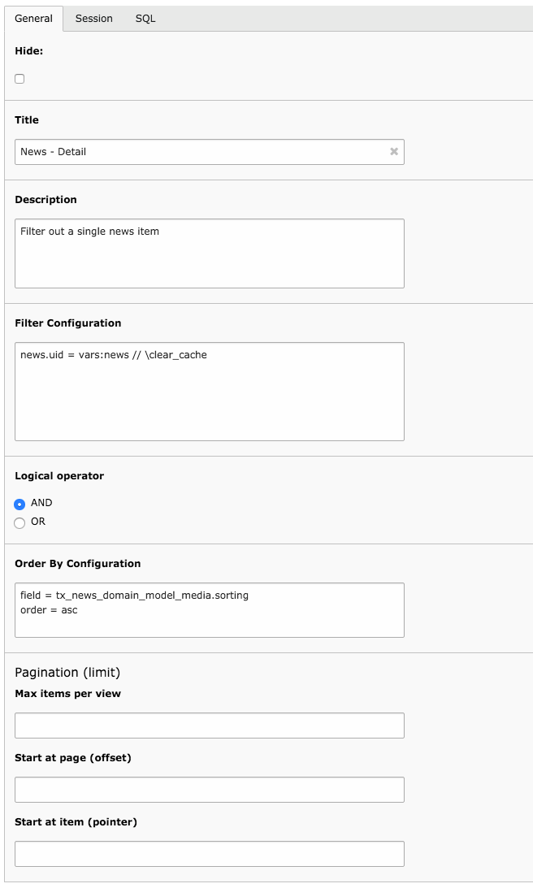

.. ==================================================
.. FOR YOUR INFORMATION
.. --------------------------------------------------
.. -*- coding: utf-8 -*- with BOM.

.. include:: ../Includes.txt

.. _introduction:

Introduction
------------

This extension provides a Data Filter (see extension "tesseract" for a
general explanation) which is capable of retrieving data from many
sources and format them into a Data Filter Structure. This structure
can then be used by a Data Provider to filter the data it will return.

On top of strictly filtering the data, the Data Filter can also return
information about capping the results (corresponding to the
LIMIT/OFFSET keywords of SQL) and about sorting the data.

.. _introduction-screenshot:

Screenshots
^^^^^^^^^^^

This shows the typical input screen of a Data Filter (note the "SQL"
tab is added by extension "dataquery"):

	A datafilter record open for input in the TYPO3 BE

.. _introduction-questions:

Questions?
^^^^^^^^^^

If you have any questions about this extension, you may want to refer
to the Tesseract Project web site (`http://www.typo3-tesseract.com/
<http://www.typo3-tesseract.com/>`_) for support and tutorials. You
may also ask questions in the TYPO3 English mailing list
(typo3.english).

.. _introduction-happy-developer:

Keeping the developer happy
^^^^^^^^^^^^^^^^^^^^^^^^^^^

If you like this extension, you may Flattr it or make noise about it by
using the social bookmarks available in the extension's detailed view
on typo3.org:

http://typo3.org/extensions/repository/view/datafilter

You may also take a step back and reflect about the beauty of sharing.
Think about how much you are benefiting and how much yourself is
giving back to the community.
