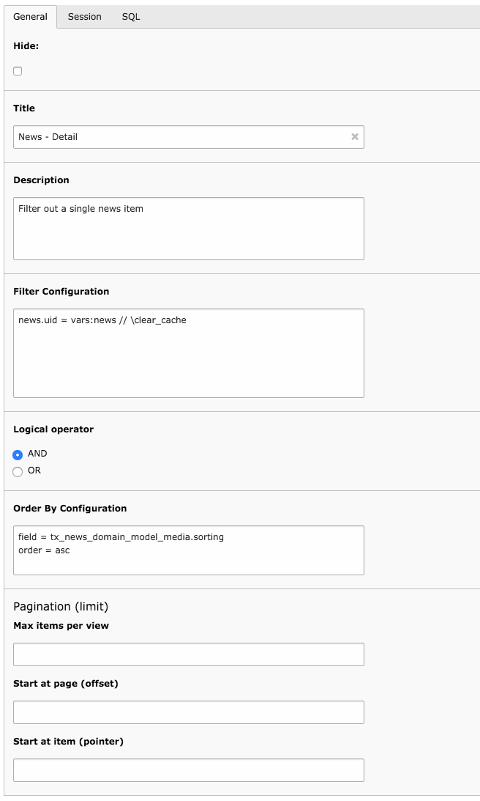

.. ==================================================
.. FOR YOUR INFORMATION
.. --------------------------------------------------
.. -*- coding: utf-8 -*- with BOM.

.. include:: ../../Includes.txt

.. _user-input:

Input screen
^^^^^^^^^^^^

This section describes the main input screen. The actual filter syntax
is described in :ref:`Filter Configuration <user-filter-configuration>`.

	The "General" tab of a datafilter record

Here are the various input fields:

Hide
  This flag is not currently used. It could be in the future.
  In the meantime it can still be used to indicate an unused filter.

Title
  A name for the filter, should be explicit enough to know
  what the filter is about.

Filter Configuration
  The filter conditions themselves. See :ref:`Filter Configuration <user-filter-configuration>`.

Logical operator
  The logical operator that will be applied
  between each filter condition. The default is :code:`AND`.

Order By Configuration
  See :ref:`Ordering Configuration <user-ordering>`.

Pagination
  See :ref:`Limits <user-limits>`.

