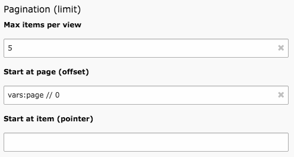

.. ==================================================
.. FOR YOUR INFORMATION
.. --------------------------------------------------
.. -*- coding: utf-8 -*- with BOM.

.. include:: ../../Includes.txt

.. _user-limits:

Limits
^^^^^^

A limit is comprised of two parts: the maximum number of elements to
display and an optional offset, which will indicated how many elements
from the start the Data Structure should really start. Both maximum
and offset can use expressions, as defined above for filters, but do
not need to match a field. So a typical configuration might look like
that:

	The Limit/Pagination configuration of a datafilter record

The above configuration returns a maximum number of 5 and an offset
defined by a variable called "page". Note that the offset is not
a number of elements, but a multiplier of  the maximum number of
items. The actual shift in the Data Structure
is the result of the maximum number multiplied by the offset.

The "Start at item (pointer)" is a number that will directly
shift the Data Structure to the corresponding item.
