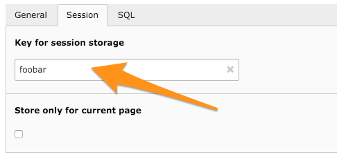

.. ==================================================
.. FOR YOUR INFORMATION
.. --------------------------------------------------
.. -*- coding: utf-8 -*- with BOM.

.. include:: ../../Includes.txt

.. _user-session:

Session storage
^^^^^^^^^^^^^^^

A filter can be stored into the session with the purpose of being
accessed by another filter. To force a filter to be stored into the
session, one must simply give it a session key (in the "Session" tab
of the input screen).

	The "Session" tab of a datafilter record

The next time this filter is called up, its result will be
stored into the session with the key "foobar". Let's assume the
following configuration:

.. code-block:: text

    interval5-10 :: pages.{vars:field_name} = [5,10]

The information will be stored in the following array format:

+---------+-------------------------------------------------------------+
| filters | +-----------+---------------------------------------------+ |
|         | | pages.uid | +--------------+--------------------------+ | |
|         | |           | | interval5-10 | +-----------+----------+ | | |
|         | |           | |              | | condition | = [5,10] | | | |
|         | |           | |              | +-----------+----------+ | | |
|         | |           | |              | | operator  | =        | | | |
|         | |           | |              | +-----------+----------+ | | |
|         | |           | |              | | value     | [5,10]   | | | |
|         | |           | |              | +-----------+----------+ | | |
|         | |           | +--------------+--------------------------+ | |
|         | +-----------+---------------------------------------------+ |
+---------+-------------------------------------------------------------+

Operator and value are stored separately, but as a convenience they
are also stored concatenated together. The advantage is that you can
use a single subexpression to get both the operator and the value.

.. note::

   If the value is an array, it will be transformed into a
   comma-separated string. This will obviously fail for multidimensional
   arrays, but it was decided to be an acceptable limitation. Indeed
   parsed filter values are meant to be retrieved using expressions (as
   per example below), so they must be of a simple type. Multidimensional
   arrays could have been serialized, but this value would have been unusable
   afterwards. Anyway it is not clear how Data Providers would interpret
   multidimensional arrays.

   **Example:**

   .. code-block:: text

        pages.uid {session:foobar|filters|pages.uid|interval5-10|condition}

   which will be interpreted as:

   .. code-block:: text

        pages.uid = [5,10]

   and then evaluated as a filter configuration line.

